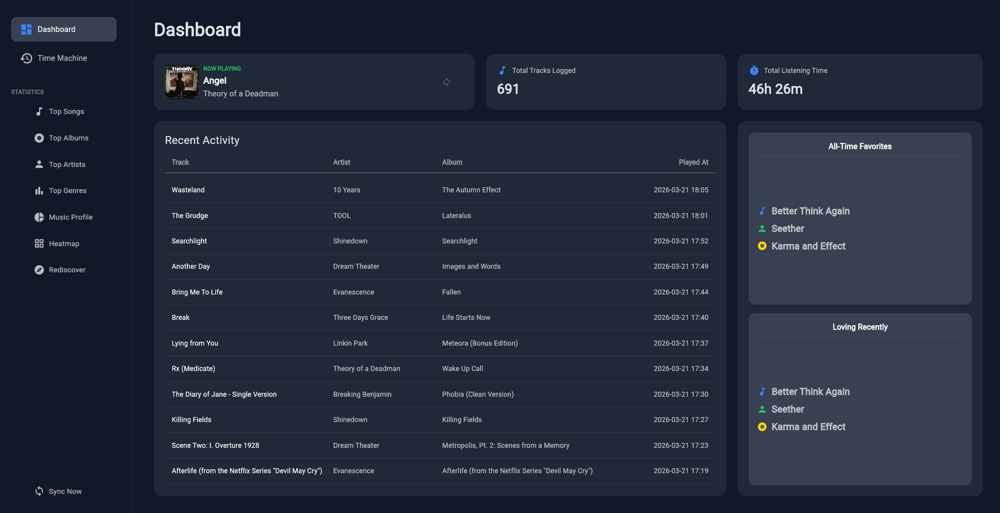
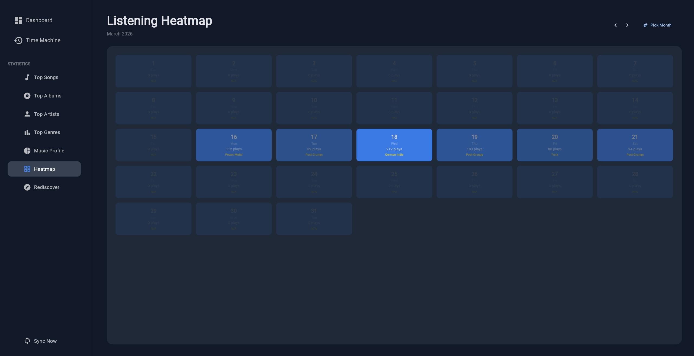
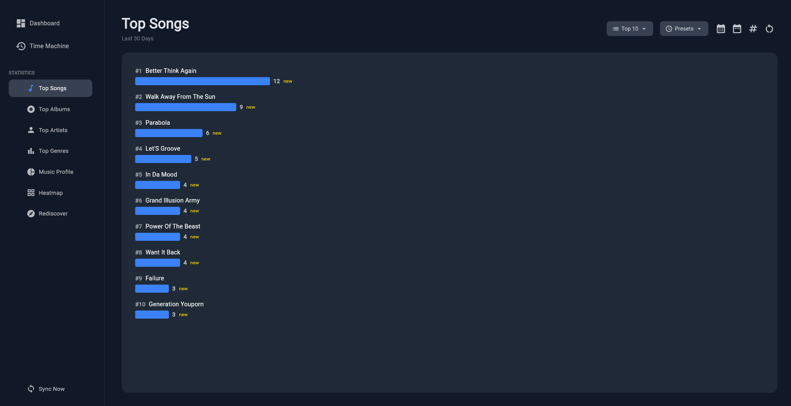
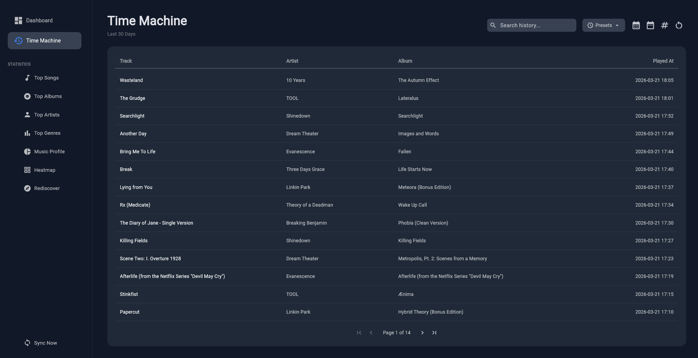

# Spotipy Dashboard

Track your listening history, analyze top genres, artists, and albums, and rediscover forgotten favorites.  
Made with Spotipy, Flet and SQLAlchemy(SQLite and PostgresSQL).

## Screenshots

| Overview | Listening Heatmap |
| :---: | :---: |
|  |  |

| Top Statistics | Time Machine |
| :---: | :---: |
|  |  |

## Quick Start (Docker)

The easiest way to run the dashboard is using Docker.

1.  **Spotify Setup**:
    *   Go to the [Spotify Developer Dashboard](https://developer.spotify.com/dashboard)
    *   Create a new App
    *   In **Settings**, add `http://127.0.0.1:8888/callback` to the **Redirect URIs**
    *   Enable the **Web API**

2.  **Configuration**:
    *   Copy `.env.example` to `.env`
    *   Fill in your `SPOTIPY_CLIENT_ID` and `SPOTIPY_CLIENT_SECRET`

3.  **Launch**:
    *   Build using SQLite (rolling backups supported)
    ```bash
    docker compose up --build
    ```
    *   Build using PostgresSQL
    ```
    docker-compose --profile postgres build
    ```

4.  **Authorize**:
    *   Open `http://127.0.0.1:8000` in your browser
    *   Follow the **Authentication Dialog**
    *   You will see a broken 127.0.0.1 page, copy that link back into the Dashboard

## Local Setup (Without Docker)

If you prefer to run the application directly in Python without docker:

1.  **Requirements**: Python 3.11+, venv recommended (Optional: pyinstaller)
2.  **Setup**: Follow steps 1 and 2 from **Quick Start (Docker)**
3.  **Use**: run_local.sh, flake.nix or build via **pyinstaller**
    ```
    pyinstaller --clean spotipy_dashboard.spec
    ```
*   *If using **pyinstaller** place your .env in the new dist/SpotipyDashboard directory*


## Development & Testing

*   **Nix**: A pre-configured development shell is provided via `flake.nix`.
*   **Testing**: The project includes a comprehensive test suite covering database constraints, sync logic, and statistics.
    *   To run tests, swap `src/requirements.txt` with `tests/requirements-test.txt` in your environment and run `pytest`.

## Stack (mainly with Gemini 3.1 Pro)

- **Frontend**: [Flet](https://flet.dev/)
- **Database**: SQLAlchemy (Async) with SQLite or PostgreSQL
- **API**: [Spotipy](https://spotipy.readthedocs.io/)

